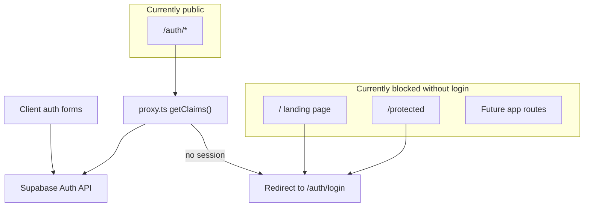

# Supabase Email/Password Auth Audit

## Verdict

**Mostly correct foundation, but not production-ready yet** for your intended model (public landing + authenticated app + email confirmation required).

The Supabase SSR wiring is sound. The issues are routing policy, email confirmation redirects, and a few integration gaps — not broken client setup.

---

## What Is Correct

### Supabase clients (SSR pattern)

Browser and server clients in [`lib/supabase/client.ts`](lib/supabase/client.ts) and [`lib/supabase/server.ts`](lib/supabase/server.ts) correctly use `@supabase/ssr` with cookie-backed sessions and the publishable key env vars.

### Session refresh via proxy (Next.js 16)

[`proxy.ts`](proxy.ts) delegates to [`lib/supabase/proxy.ts`](lib/supabase/proxy.ts), which:
- Creates a per-request server client
- Calls `getClaims()` to refresh JWT cookies (required for SSR stability)
- Returns the response with updated cookies

This matches the current Supabase SSR guidance and your [`AGENTS.md`](AGENTS.md) convention (use `proxy.ts`, not `middleware.ts`).

### Auth flows implemented

| Flow | Implementation | Status |
|------|----------------|--------|
| Sign in | [`components/login-form.tsx`](components/login-form.tsx) → `signInWithPassword` | Correct |
| Sign up | [`components/sign-up-form.tsx`](components/sign-up-form.tsx) → `signUp` | Correct API, wrong redirect target |
| Sign out | [`components/logout-button.tsx`](components/logout-button.tsx) → `signOut` | Correct |
| Forgot password | [`components/forgot-password-form.tsx`](components/forgot-password-form.tsx) → `resetPasswordForEmail` | Correct |
| Update password | [`components/update-password-form.tsx`](components/update-password-form.tsx) → `updateUser({ password })` | Correct |
| Email OTP confirm | [`app/auth/confirm/route.ts`](app/auth/confirm/route.ts) → `verifyOtp` | Correct handler, not wired into sign-up |

### Dependencies

[`package.json`](package.json) pins `@supabase/ssr@0.12.0` and `@supabase/supabase-js@2.110.0` — appropriate versions.

---

## Architecture (Current)



---

## Issues To Fix (Priority Order)

### 1. Critical — Proxy blocks your public landing page

[`lib/supabase/proxy.ts`](lib/supabase/proxy.ts) redirects **all** unauthenticated requests except `/auth/*` to login:

```41:49:lib/supabase/proxy.ts
  if (
    !user &&
    !request.nextUrl.pathname.startsWith('/login') &&
    !request.nextUrl.pathname.startsWith('/auth')
  ) {
    const url = request.nextUrl.clone()
    url.pathname = '/auth/login'
    return NextResponse.redirect(url)
  }
```

**Impact:** [`app/(root)/page.tsx`](app/(root)/page.tsx) (your landing/marketing page) is unreachable without signing in — contradicts your goal.

**Fix:** Invert the protection model to match your intent:
- **Public:** `/`, `/auth/*`, and future marketing paths (e.g. `/pricing`, `/about`)
- **Protected:** everything else (`/protected`, future dashboard/workspace routes)

Suggested approach in `lib/supabase/proxy.ts`:

```typescript
const PUBLIC_PREFIXES = ['/', '/auth']
const isPublicRoute = PUBLIC_PREFIXES.some(
  (prefix) =>
    pathname === prefix ||
    (prefix !== '/' && pathname.startsWith(prefix))
)

if (!user && !isPublicRoute) {
  // redirect to login
}
```

Also remove the stale `/login` check (login lives at `/auth/login`).

Optionally redirect authenticated users away from `/auth/login` and `/auth/sign-up` to `/protected` (or your future dashboard route).

---

### 2. Critical — Email confirmation redirect is misconfigured

Since **Confirm email is enabled**, sign-up must route confirmation links through your server-side verifier.

Current sign-up redirect in [`components/sign-up-form.tsx`](components/sign-up-form.tsx):

```44:46:components/sign-up-form.tsx
        options: {
          emailRedirectTo: `${window.location.origin}/protected`,
        },
```

**Problem:** Confirmation links skip [`app/auth/confirm/route.ts`](app/auth/confirm/route.ts), so `verifyOtp` never runs. Users may land on `/protected` without a valid session cookie, or confirmation may fail silently depending on Supabase email template format.

**Fix:** Point confirmation through the confirm route:

```typescript
emailRedirectTo: `${window.location.origin}/auth/confirm?next=/protected`
```

**Supabase Dashboard (manual step):** Under **Auth → URL Configuration**, allowlist:
- `http://localhost:3000/auth/confirm`
- `http://localhost:3000/auth/update-password`
- Production equivalents

**Email template check:** Ensure the confirmation email uses a link that includes `token_hash` and `type` query params (Supabase default template usually does when `SITE_URL` and redirect URLs are configured). Example target:

```
{{ .SiteURL }}/auth/confirm?token_hash={{ .TokenHash }}&type=email&next=/protected
```

---

### 3. High — Missing PKCE callback route

There is no [`app/auth/callback/route.ts`](app/auth/callback/route.ts) with `exchangeCodeForSession`. Modern Supabase SSR projects use PKCE for email links and OAuth.

**Impact:** Password recovery and some confirmation links may arrive as `?code=...` instead of `token_hash`. Without a callback route, those links fail.

**Fix:** Add the standard callback handler:

```typescript
// app/auth/callback/route.ts
import { createClient } from '@/lib/supabase/server'
import { NextResponse } from 'next/server'

export async function GET(request: Request) {
  const { searchParams, origin } = new URL(request.url)
  const code = searchParams.get('code')
  const next = searchParams.get('next') ?? '/protected'

  if (code) {
    const supabase = await createClient()
    const { error } = await supabase.auth.exchangeCodeForSession(code)
    if (!error) {
      return NextResponse.redirect(`${origin}${next}`)
    }
  }

  return NextResponse.redirect(`${origin}/auth/error?error=Could not authenticate`)
}
```

Update password reset redirect to also support PKCE if needed:

```typescript
redirectTo: `${window.location.origin}/auth/callback?next=/auth/update-password`
```

Keep [`app/auth/confirm/route.ts`](app/auth/confirm/route.ts) as a fallback for `token_hash` OTP links.

---

### 4. Medium — Navbar not connected to auth

[`app/(root)/_components/navbar.tsx`](app/(root)/_components/navbar.tsx) defaults `signInHref` to `#signin` and buttons use `preventDefault()` without navigation.

**Fix:** Wire Sign In → `/auth/login`, Get Started → `/auth/sign-up` (via `signInHref`/`ctaHref` props or `Link`/`router.push` in [`app/(root)/layout.tsx`](app/(root)/layout.tsx)).

---

### 5. Low — UX polish after auth state changes

In login, logout, and password update forms, add `router.refresh()` after successful `signIn` / `signOut` / `updateUser` so server components pick up the new session immediately.

Example in [`components/login-form.tsx`](components/login-form.tsx):

```typescript
router.push('/protected')
router.refresh()
```

---

### 6. Informational — Protected page is starter boilerplate

[`app/protected/page.tsx`](app/protected/page.tsx) is the Supabase starter example (shows email + logout). This is fine as a smoke test; replace with your real post-auth destination when ready.

---

## Supabase Dashboard Checklist (Manual)

Before testing end-to-end, verify in Supabase Dashboard → **Authentication**:

| Setting | Expected |
|---------|----------|
| Email provider | Enabled |
| Confirm email | Enabled (matches your setup) |
| Site URL | `http://localhost:3000` (dev) |
| Redirect URLs | `/auth/confirm`, `/auth/callback`, `/auth/update-password`, `/protected` |
| Email templates | Confirmation + recovery links point to your app routes |

---

## Recommended Test Plan (After Fixes)

1. **Public access:** Visit `/` while logged out — landing page loads, no redirect to login
2. **Sign up:** Create account → see `/auth/sign-up-success` → receive confirmation email
3. **Confirm email:** Click link → lands on `/auth/confirm` or `/auth/callback` → session established → redirected to `/protected`
4. **Sign in:** Login with confirmed credentials → `/protected` shows user email
5. **Protected route:** Visit `/protected` logged out → redirected to `/auth/login`
6. **Password reset:** Request reset → click email link → update password → login with new password
7. **Sign out:** Logout → session cleared → `/protected` redirects to login

---

## Summary

| Area | Status |
|------|--------|
| Supabase client setup | Good |
| Session refresh (proxy) | Good |
| Login / sign-up / reset forms | Good |
| Route protection policy | **Needs fix** — landing incorrectly gated |
| Email confirmation wiring | **Needs fix** — redirect bypasses confirm route |
| PKCE callback | **Missing** — add for robust link handling |
| Marketing → auth navigation | **Not wired** |
| Dashboard URL allowlist | **Verify manually** |

No database migrations or RLS are required for basic email/password auth — those come later when you add app-specific user data (profiles, workspaces, etc.).
