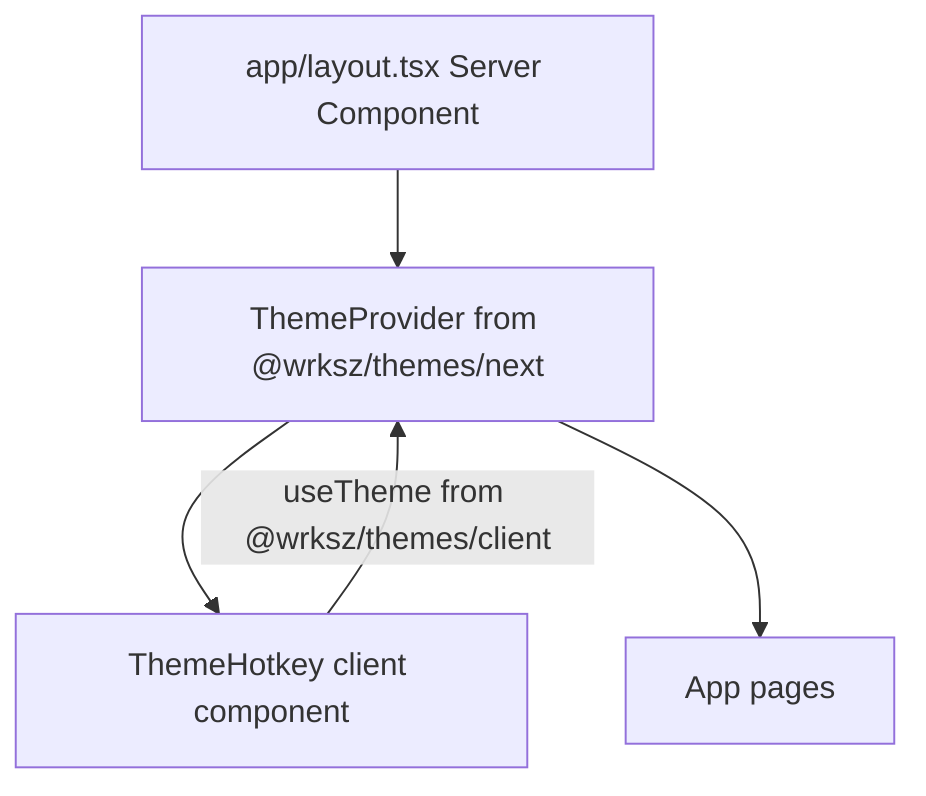

# Migrate from next-themes to @wrksz/themes

## Current state

- [`package.json`](package.json) already has `@wrksz/themes@0.9.7` and no `next-themes` dependency.
- [`components/theme-provider.tsx`](components/theme-provider.tsx) still imports from `next-themes` — this will fail at build/runtime.
- [`app/layout.tsx`](app/layout.tsx) wraps the app with the custom `ThemeProvider`.
- Theme toggling is handled by a `ThemeHotkey` component (press `d`) inside that wrapper, referenced on the landing page in [`app/(root)/page.tsx`](app/(root)/page.tsx).
- CSS in [`app/globals.css`](app/globals.css) uses class-based dark mode (`.dark { ... }`) — compatible with `@wrksz/themes` defaults (`attribute="class"`).

## Target architecture



Key constraint from `@wrksz/themes` docs: **`ThemeProvider` from `@wrksz/themes/next` is an async Server Component** and must be used directly in `layout.tsx`, not inside a `"use client"` wrapper.

---

## Implementation steps

### 1. Move provider to root layout

Update [`app/layout.tsx`](app/layout.tsx):

- Import `ThemeProvider` from `@wrksz/themes/next` (not from the local wrapper).
- Pass the same props currently set in the wrapper:

```tsx
<ThemeProvider
  attribute="class"
  defaultTheme="system"
  enableSystem
  disableTransitionOnChange
>
  <ThemeHotkey />
  {children}
</ThemeProvider>
```

- Keep `suppressHydrationWarning` on `<html>` (already present).

### 2. Refactor the client wrapper

Replace [`components/theme-provider.tsx`](components/theme-provider.tsx) with a client-only hotkey module, e.g. [`components/theme-hotkey.tsx`](components/theme-hotkey.tsx):

- Change import: `useTheme` from `@wrksz/themes/client` (instead of `next-themes`).
- Move `ThemeHotkey` and `isTypingTarget` helper unchanged — the `useTheme()` API is identical (`resolvedTheme`, `setTheme`).
- Delete the old `ThemeProvider` re-export from this file.

Alternatively, rename the file in place and export only `ThemeHotkey` — either approach works; prefer a dedicated `theme-hotkey.tsx` for clarity.

### 3. Update layout import

In [`app/layout.tsx`](app/layout.tsx), replace:

```tsx
import { ThemeProvider } from "@/components/theme-provider"
```

with:

```tsx
import { ThemeProvider } from "@wrksz/themes/next"
import { ThemeHotkey } from "@/components/theme-hotkey"
```

### 4. Verify no remaining next-themes references

Only one reference exists today in `components/theme-provider.tsx`. After refactor, grep the repo to confirm zero `next-themes` imports.

### 5. Validate

- `bun run typecheck`
- `bun run build`
- Manual: press `d` on `/` to toggle light/dark; confirm `.dark` class toggles on `<html>` and colors update.

---

## Optional enhancement (recommended, not required)

Add `storage="cookie"` to `ThemeProvider` for zero-flash SSR on reload:

```tsx
<ThemeProvider storage="cookie" attribute="class" defaultTheme="system" enableSystem disableTransitionOnChange>
```

This is a `@wrksz/themes`-specific improvement over `next-themes`. Safe to add during migration since the app already uses cookie-friendly SSR patterns.

---

## Files changed

| File | Action |
|------|--------|
| [`app/layout.tsx`](app/layout.tsx) | Use `@wrksz/themes/next` provider + render `ThemeHotkey` |
| [`components/theme-provider.tsx`](components/theme-provider.tsx) | Remove or replace with `theme-hotkey.tsx` |
| [`components/theme-hotkey.tsx`](components/theme-hotkey.tsx) | New client component with `useTheme` from `@wrksz/themes/client` |

No changes needed to [`app/globals.css`](app/globals.css) or [`package.json`](package.json) — dependency swap is already done.
